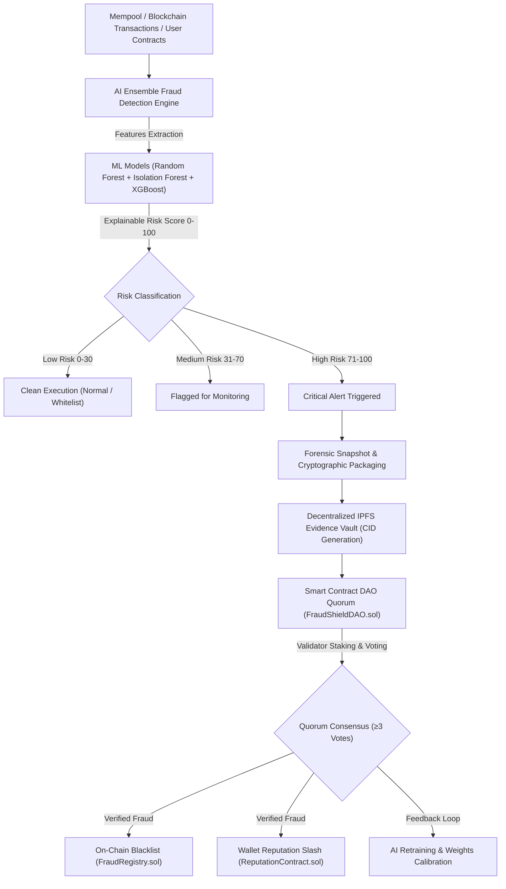

# 🛡️ AI FraudShield

> **Decentralized AI Fraud Intelligence & Full-Stack Web3 Security Protocol**

AI FraudShield combines machine learning anomaly detection, decentralized on-chain governance (DAO), cryptographic evidence storage on IPFS, and a comprehensive Web3 Security Suite to protect decentralized finance ecosystems.

---

## 🌟 Key Features

- 🧠 **AI Ensemble Risk Engine**: Combines Random Forest, Isolation Forest, and XGBoost to generate an explainable 0–100 risk score.
- 📦 **IPFS Forensic Evidence Vault**: Pins cryptographically verifiable investigation snapshots to decentralized IPFS storage.
- ⚖️ **DAO Validator Quorum**: Decentralized on-chain voting (`FraudShieldDAO.sol`, `FraudRegistry.sol`, `ReputationContract.sol`) for immutable blacklisting and trust scoring.
- 🔄 **Active Learning Feedback Loop**: DAO-confirmed verdicts automatically retrain and calibrate AI models.
- 🔍 **Smart Contract Vulnerability Scanner**: Static AST analyzer detecting Reentrancy, `tx.origin` traps, missing access controls, and arbitrary `delegatecall` vulnerabilities with remediation code diffs.
- 🍯 **Token Honeypot & Anti-Dump Simulator**: Simulates DEX buy/sell swaps to expose 100% sell taxes, transfer blacklists, and hidden mint hooks.
- 🔑 **Wallet Allowance Guardian**: Scans active token approvals, identifies dangerous unlimited allowances (`type(uint256).max`), and provides 1-click batch revoking.
- 📡 **Global Threat Radar & SIEM**: Live telemetry feed tracking cross-chain flashloan attacks, mempool frontrunning snipers, and phishing campaigns with DEFCON threat index.

---

## 📸 Interactive Demo & Screenshots Guide

A full step-by-step interactive walkthrough with high-resolution visual screenshots and live session recording is available in:
👉 **[Interactive Demo & How-to-Use Guide](file:///C:/Users/naman/.gemini/antigravity-ide/brain/7c393532-6150-4bd6-81d5-d8edf5fb178b/demo_guide_with_screenshots.md)**

---

## 🏗️ Architecture & How It Works



---

## 🎯 Real-World Use Cases

### 1. Web3 Wallet Pre-Transaction Security Firewall
- Blocks malicious Permit/Permit2 typed signature drainers before the user approves the transaction.

### 2. DEX & DeFi Protocol Liquidity Protection
- Simulates token buy/sell liquidity to flag honeypots with predatory dump fees and prevent sandwich attacks.

### 3. DAO Treasury & Smart Contract Safeguards
- Protects multi-sig vaults with on-chain circuit breakers triggered by high-risk anomaly detections.

### 4. Forensic Investigations & Legal Compliance
- Creates tamper-proof, time-stamped evidentiary bundles stored on IPFS with verifiable on-chain CIDs.

### 5. Smart Contract Developer Security CI/CD
- Provides instant static code audits with remediation diffs and downloadable security certificates prior to mainnet deployment.

---

## 🚀 Quick Start

### Prerequisites
- Node.js (v18+)
- npm or yarn

### Installation
```bash
# Clone the repository
git clone https://github.com/namanartist/AIFraudSheild.git
cd AIFraudSheild

# Install dependencies
npm install

# Run frontend development server
npm run dev

# Run backend AI & Security API server
npm run server
```

The application will be accessible at `http://localhost:5173`.

---

## 📜 Smart Contracts (Polygon Amoy & Ethereum Sepolia)

- `FraudRegistry.sol`: On-chain blacklist registry for verified fraudulent addresses and malicious contracts.
- `FraudShieldDAO.sol`: Staking, reporting, and validator consensus quorum logic.
- `ReputationContract.sol`: Dynamic reputation score tracking (0–100) per address.

---

## 🛡️ License

MIT License © 2026 AI FraudShield Protocol
